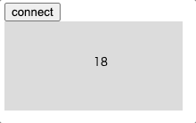
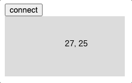
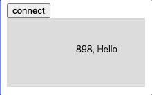

# Getting Started

## gotByte: Gets single byte from arduiono


`index.html`
```html
<!DOCTYPE html>
<html lang="en">

<head>
    <meta charset="UTF-8">
    <meta name="viewport" content="width=device-width, initial-scale=1.0">
    <script src="https://cdnjs.cloudflare.com/ajax/libs/p5.js/1.9.0/p5.js"></script>
    <title>p5.js Template</title>
</head>

<body>
    <button onclick="serial.begin()">connect</button>
    <script src="https://cdn.jsdelivr.net/gh/TetsuakiBaba/p5.serial.js/p5.serial.js" type="text/javascript"></script>
    <script>
        let serial = new Serial();
        let g_value;
        function setup() {
            createCanvas(200, 100);
            serial.gotByte = function (value) {
                g_value = value;
            }
        }
        function draw() {
            background(220);
            text(`${g_value}`,
                width / 2, height / 2);
        }
    </script>
</body>

</html>
```

`arduino.ino`
```cpp
void setup() {
  // put your setup code here, to run once:
  Serial.begin(9600);
}

int counter = 0;
void loop() {
  // put your main code here, to run repeatedly:
  Serial.write(counter);
  counter++;
  delay(33);
}
```

## gotBytes: Gets multiple bytes from arduiono
For defined data protocols, data may not be received in the correct format. In this case, use gotCSV.



`index.html`
```html
<!DOCTYPE html>
<html lang="en">

<head>
    <meta charset="UTF-8">
    <meta name="viewport" content="width=device-width, initial-scale=1.0">
    <script src="https://cdnjs.cloudflare.com/ajax/libs/p5.js/1.9.0/p5.js"></script>
    <title>p5.js Template</title>
</head>

<body>
    <button onclick="serial.begin()">connect</button>
    <script src="https://cdn.jsdelivr.net/gh/TetsuakiBaba/p5.serial.js/p5.serial.js" type="text/javascript"></script>
    <script>
        let serial = new Serial();
        let g_values = [];
        function setup() {
            createCanvas(200, 100);
            serial.gotBytes = function (values) {
                g_values = values;
            }
        }
        function draw() {
            background(220);
            if (g_values.length == 2) {
                text(`${g_values[0]}, ${g_values[1]}`,
                    width / 2, height / 2);
            }
        }
    </script>
</body>

</html>
```

`arduino.ino`
```cpp
void setup() {
  Serial.begin(9600);
}

int counter = 0;
char buf[2];
void loop() {
  buf[0] = counter;
  buf[1] = 25;
  Serial.write(buf,2);
  counter++;
  delay(33);
}
```

## gotCSV: Gets CSV string from arduiono


`index.html`
```html
<!DOCTYPE html>
<html lang="en">

<head>
    <meta charset="UTF-8">
    <meta name="viewport" content="width=device-width, initial-scale=1.0">
    <script src="https://cdnjs.cloudflare.com/ajax/libs/p5.js/1.9.0/p5.js"></script>
    <title>p5.js Template</title>
</head>

<body>
    <button onclick="serial.begin()">connect</button>
    <script src="https://cdn.jsdelivr.net/gh/TetsuakiBaba/p5.serial.js/p5.serial.js" type="text/javascript"></script>
    <script>
        let serial = new Serial();
        let g_values = [];
        function setup() {
            createCanvas(200, 100);
            serial.gotCSV = function (values) {
                g_values = values;
            }
        }
        function draw() {
            background(220);
            if (g_values.length == 2) {
                text(`${g_values[0]}, ${g_values[1]}`,
                    width / 2, height / 2);
            }
        }
    </script>
</body>

</html>
```

`arduino.ino`
```cpp
void setup() {
  Serial.begin(9600);
}
int counter = 0;
void loop() {
  Serial.println(String(counter)+",Hello");
  counter++;
  delay(33);
}
```

## TBA: Write methods examples